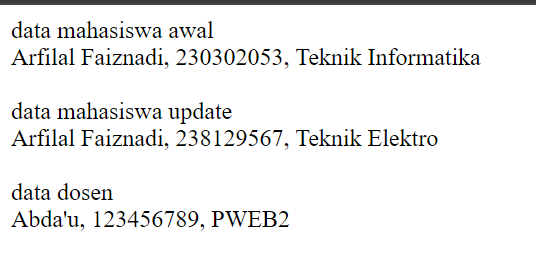
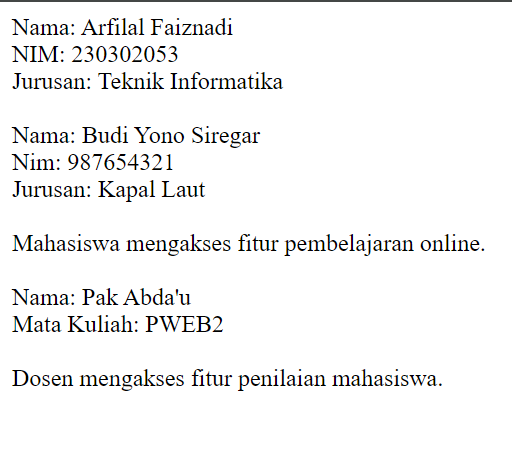

# PHP OOP PERTEMUAN 1 dan 2

## 1. Pembuatan Kelas

### Kelas Mahasiswa

```php
class Mahasiswa {
    public $nama;
    public $nim;
    public $jurusan;

    public function __construct($nama, $nim, $jurusan) {
        $this->nama = $nama;
        $this->nim = $nim;
        $this->jurusan = $jurusan;
    }

    // Metode-metode lain...
}
```

Penjelasan:
- Kelas `Mahasiswa` didefinisikan dengan tiga properti publik: `$nama`, `$nim`, dan `$jurusan`.
- Konstruktor (`__construct`) digunakan untuk menginisialisasi objek dengan nilai-nilai awal.
- `$this` mengacu pada instance objek saat ini.

### Kelas Dosen

```php
class Dosen {
    public $nama;
    public $nip;
    public $mataKuliah;

    public function __construct($nama, $nip, $mataKuliah) {
        $this->nama = $nama;
        $this->nip = $nip;
        $this->mataKuliah = $mataKuliah;
    }

    // Metode lain...
}
```

Penjelasan:
- Kelas `Dosen` memiliki struktur serupa dengan `Mahasiswa`, dengan properti yang sesuai untuk dosen.
- Konstruktor digunakan untuk inisialisasi objek dosen.

## 2. Penggunaan Metode

### Metode dalam Kelas Mahasiswa

1. `tampilkandata()`
   ```php
   public function tampilkandata() {
       return "$this->nama, $this->nim, $this->jurusan";
   }
   ```
   - Metode ini mengembalikan string yang berisi informasi mahasiswa.

2. `updatejurusan($jurusan_baru)`
   ```php
   public function updatejurusan($jurusan_baru) {
       $this->jurusan = $jurusan_baru;
   }
   ```
   - Metode ini memperbarui jurusan mahasiswa.

3. `setnim($nim)`
   ```php
   public function setnim($nim) {
       $this->nim = $nim;
   }
   ```
   - Metode ini mengatur NIM baru untuk mahasiswa.

### Metode dalam Kelas Dosen

1. `tampilkanDosen()`
   ```php
   public function tampilkanDosen() {
       return "$this->nama, $this->nip, $this->mataKuliah";
   }
   ```
   - Metode ini mengembalikan string yang berisi informasi dosen.

## 3. Penggunaan Kelas dan Metode

### Penggunaan Kelas Mahasiswa

```php
$mahasiswa1 = new Mahasiswa("Arfilal Faiznadi", "230302053", "Teknik Informatika");
echo $mahasiswa1->tampilkandata();
$mahasiswa1->updatejurusan("Teknik Elektro");
$mahasiswa1->setnim("238129567");
echo $mahasiswa1->tampilkandata();
```

Penjelasan:
1. Objek `$mahasiswa1` dibuat dengan data awal.
2. Data awal ditampilkan menggunakan `tampilkandata()`.
3. Jurusan diperbarui menggunakan `updatejurusan()`.
4. NIM diperbarui menggunakan `setnim()`.
5. Data yang diperbarui ditampilkan kembali.

### Penggunaan Kelas Dosen

```php
$Dosen1 = new Dosen("Abda'u", "123456789", "PWEB2");
echo $Dosen1->tampilkanDosen();
```

Penjelasan:
1. Objek `$Dosen1` dibuat dengan data dosen.
2. Data dosen ditampilkan menggunakan `tampilkanDosen()`.

## 4. Hasil Output

Berikut adalah hasil output yang diharapkan dari eksekusi kode:


```

Penjelasan output:
1. Data mahasiswa awal ditampilkan, menunjukkan nama, NIM, dan jurusan asli.
2. Setelah pembaruan, data mahasiswa yang diperbarui ditampilkan dengan NIM dan jurusan yang baru.
3. Data dosen ditampilkan, menunjukkan nama, NIP, dan mata kuliah yang diajar.

## Kesimpulan

Kode ini mendemonstrasikan konsep dasar OOP dalam PHP:
- Enkapsulasi: Data dan metode dikelompokkan dalam kelas.
- Konstruktor: Digunakan untuk inisialisasi objek.
- Metode: Fungsi-fungsi yang memanipulasi data objek.
- Instansiasi objek: Pembuatan instance dari kelas.

# PHP OOP Pertemuan 3 dan 4

Proyek ini mendemonstrasikan implementasi konsep-konsep utama Pemrograman Berorientasi Objek (OOP) menggunakan PHP. Kode ini mencakup pembuatan kelas, objek, encapsulation, inheritance, polymorphism, dan abstraction.

## Daftar Isi
1. [Struktur Proyek](#struktur-proyek)
2. [Konsep OOP dan Implementasi](#konsep-oop-dan-implementasi)
3. [Kode Sumber](#kode-sumber)
4. [Hasil Output](#hasil-output)
5. [Penjelasan Langkah-langkah](#penjelasan-langkah-langkah)

## Struktur Proyek

Proyek ini terdiri dari satu file PHP:

- `jobsheet2.php`: File utama yang berisi implementasi konsep OOP.

## Konsep OOP dan Implementasi

1. **Membuat Class dan Object**
   - Kelas `Mahasiswa` dan `Dosen` diimplementasikan.
   - Objek dibuat dari kelas-kelas tersebut.

2. **Encapsulation**
   - Properti private dengan getter dan setter.

3. **Inheritance**
   - Kelas `Pengguna` sebagai kelas induk.
   - Kelas `Dosen` mewarisi dari `Pengguna`.

4. **Polymorphism**
   - Metode `aksesFitur()` diimplementasikan berbeda di kelas `Mahasiswa` dan `Dosen`.

5. **Abstraction**
   - Kelas abstrak `Pengguna` dengan metode abstrak `aksesFitur()`.

## Kode Sumber

```php
<?php

// 1. Membuat Class dan Object
class Mahasiswa {
    private $nama;
    private $nim;
    private $jurusan;

    public function __construct($nama, $nim, $jurusan) {
        $this->nama = $nama;
        $this->nim = $nim;
        $this->jurusan = $jurusan;
    }

    public function tampilkanData() {
        return "Nama: {$this->nama}, NIM: {$this->nim}, Jurusan: {$this->jurusan}";
    }

    // 2. Encapsulation: Getter dan Setter
    public function getNama() {
        return $this->nama;
    }

    public function setNama($nama) {
        $this->nama = $nama;
    }

    // ... (getter dan setter lainnya)

    // 4. Polymorphism
    public function aksesFitur() {
        return "Mahasiswa mengakses fitur pembelajaran online.";
    }
}

// 3. Inheritance
abstract class Pengguna {
    protected $nama;

    public function __construct($nama) {
        $this->nama = $nama;
    }

    public function getNama() {
        return $this->nama;
    }

    // 5. Abstraction
    abstract public function aksesFitur();
}

class Dosen extends Pengguna {
    private $mataKuliah;

    public function __construct($nama, $mataKuliah) {
        parent::__construct($nama);
        $this->mataKuliah = $mataKuliah;
    }

    public function getMataKuliah() {
        return $this->mataKuliah;
    }

    public function tampilkanData() {
        return "Nama Dosen: {$this->nama}, Mata Kuliah: {$this->mataKuliah}";
    }

    // 4. Polymorphism
    public function aksesFitur() {
        return "Dosen mengakses fitur penilaian mahasiswa.";
    }
}

// Penggunaan
echo "1. Membuat Class dan Object:\n";
$mahasiswa1 = new Mahasiswa("Budi Santoso", "12345", "Teknik Informatika");
echo $mahasiswa1->tampilkanData() . "\n\n";

echo "2. Encapsulation:\n";
$mahasiswa1->setNama("Budi Prasetyo");
echo "Nama baru: " . $mahasiswa1->getNama() . "\n\n";

echo "3. Inheritance:\n";
$dosen1 = new Dosen("Dr. Siti Aisyah", "Pemrograman Web");
echo $dosen1->tampilkanData() . "\n\n";

echo "4. Polymorphism:\n";
echo "Mahasiswa: " . $mahasiswa1->aksesFitur() . "\n";
echo "Dosen: " . $dosen1->aksesFitur() . "\n\n";

echo "5. Abstraction:\n";
$pengguna1 = $mahasiswa1;
$pengguna2 = $dosen1;
echo "Pengguna 1 (Mahasiswa): " . $pengguna1->aksesFitur() . "\n";
echo "Pengguna 2 (Dosen): " . $pengguna2->aksesFitur() . "\n";
```

## Hasil Output





## Penjelasan Langkah-langkah

1. **Membuat Class dan Object**
   - Kelas `Mahasiswa` dan `Dosen` didefinisikan dengan properti dan metode.
   - Objek `$mahasiswa1` dibuat dari kelas `Mahasiswa`.

2. **Encapsulation**
   - Properti `$nama`, `$nim`, dan `$jurusan` di kelas `Mahasiswa` dibuat private.
   - Getter dan setter diimplementasikan untuk mengakses dan memodifikasi properti.
   - Contoh penggunaan: `$mahasiswa1->setNama("Budi Prasetyo")`.

3. **Inheritance**
   - Kelas abstrak `Pengguna` dibuat sebagai kelas dasar.
   - Kelas `Dosen` mewarisi dari `Pengguna` menggunakan keyword `extends`.
   - Konstruktor kelas anak memanggil konstruktor induk dengan `parent::__construct()`.

4. **Polymorphism**
   - Metode `aksesFitur()` diimplementasikan berbeda di `Mahasiswa` dan `Dosen`.
   - Objek dari kedua kelas dapat memanggil metode yang sama dengan hasil berbeda.

5. **Abstraction**
   - Kelas `Pengguna` dibuat abstrak dengan metode abstrak `aksesFitur()`.
   - Kelas turunan (`Dosen` dan `Mahasiswa`) harus mengimplementasikan metode abstrak ini.

Kode ini mendemonstrasikan bagaimana konsep-konsep OOP dapat diimplementasikan dalam PHP, membuat struktur program yang lebih terorganisir dan mudah dipelihara.


# PHP OOP Pertemuan 5 dan 6

Proyek ini adalah implementasi sistem manajemen universitas sederhana menggunakan PHP, dengan fokus pada penerapan prinsip-prinsip Pemrograman Berorientasi Objek (OOP). Proyek ini mencakup manajemen data dosen, mahasiswa, dan jurnal akademik.

## Penerapan Konsep OOP

### 1. Inheritance (Pewarisan)

Inheritance diterapkan melalui penggunaan kelas turunan yang mewarisi sifat dan perilaku dari kelas induk.

#### Contoh:
- Kelas `Dosen` dan `Mahasiswa` mewarisi dari kelas abstrak `Person`.
- Kelas `JurnalDosen` dan `JurnalMahasiswa` mewarisi dari kelas abstrak `Jurnal`.

```php
abstract class Person {
    // ...
}

class Dosen extends Person {
    // ...
}

class Mahasiswa extends Person {
    // ...
}
```

### 2. Polymorphism (Polimorfisme)

Polimorfisme diterapkan melalui penggunaan metode yang memiliki nama sama namun implementasi berbeda di kelas-kelas turunan.

#### Contoh:
- Metode `getRole()` di-override di kelas `Dosen` dan `Mahasiswa`.
- Metode `ajukanJurnal()` diimplementasikan secara berbeda di `JurnalDosen` dan `JurnalMahasiswa`.

```php
abstract class Person {
    abstract public function getRole();
}

class Dosen extends Person {
    public function getRole() {
        return "Dosen";
    }
}

class Mahasiswa extends Person {
    public function getRole() {
        return "Mahasiswa";
    }
}
```

### 3. Encapsulation (Enkapsulasi)

Enkapsulasi diterapkan dengan membuat atribut private dan menyediakan metode getter untuk mengaksesnya.

#### Contoh:
- Atribut `nidn` di kelas `Dosen` dan `nim` di kelas `Mahasiswa` dibuat private.
- Metode getter (`getNidn()` dan `getNim()`) disediakan untuk mengakses atribut tersebut.

```php
class Dosen extends Person {
    private $nidn;

    public function getNidn() {
        return $this->nidn;
    }
}

class Mahasiswa extends Person {
    private $nim;

    public function getNim() {
        return $this->nim;
    }
}
```

### 4. Abstraction (Abstraksi)

Abstraksi diterapkan melalui penggunaan kelas abstrak dan metode abstrak.

#### Contoh:
- Kelas `Person` dan `Jurnal` dibuat sebagai kelas abstrak.
- Metode abstrak `getRole()` di kelas `Person` dan `ajukanJurnal()` di kelas `Jurnal`.

```php
abstract class Person {
    abstract public function getRole();
}

abstract class Jurnal {
    abstract public function ajukanJurnal();
}
```

5. Lihat output untuk melihat contoh penggunaan kelas-kelas yang telah dibuat.

## Contoh Output


## Kesimpulan

Proyek ini mendemonstrasikan penerapan empat konsep utama OOP dalam konteks sistem manajemen universitas:

1. **Inheritance** memungkinkan pembuatan hierarki kelas yang logis dan efisien.
2. **Polymorphism** memungkinkan fleksibilitas dalam implementasi metode di kelas-kelas turunan.
3. **Encapsulation** melindungi data sensitif dan menyediakan antarmuka yang terkontrol untuk mengaksesnya.
4. **Abstraction** memungkinkan pembuatan kerangka kerja yang dapat diperluas untuk jenis-jenis Person dan Jurnal.
